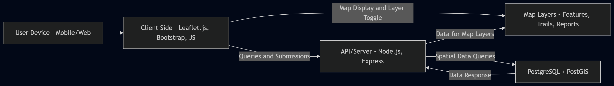

# GEOG 777 Project 2 Repository

This repository is designed to house the development workflows, data models, and documentation for **GEOG 777 Project 2**.
Project 2 focuses on building a mobile friendly, user centered WebGIS application for park visitors.  The app will allow exploration of park features on an interactive map, searching by themes such as safety, accessibility, and recreation, and enabling visitor data submission.

**************
**_Note: This project is being developed following an agile framework. The design, features, and tools are subject to change as feedback is received and as work progresses._**
**************

Repository link: [dvanosdall/GEOG_777_Project_2](https://github.com/dvanosdall/GEOG_777_Project_2)

---

## Table of Contents
- [WebGIS Project Overview + Park App](#webgis-project-overview--park-app)
  - [Introduction](#introduction)
  - [Problem Overview](#1-problem-overview)
  - [Implementation Plan (Workflow)](#2-implementation-plan-workflow)
- [Technologies Used](#technologies-used)
- [Database Design](#database-design)
- [Steps](#steps)
- [Project Timeline and Key Milestones](#3-project-timeline-and-key-milestones)
- [Running the Application](#running-the-application)
  - [Prerequisites](#prerequisites)
  - [Installation](#installation)
  - [Running](#running)
  - [Using the Application](#using-the-application)

---

# WebGIS Project Overview + Park App

## Introduction

Park visitors often lack easy digital access to maps, facility info, and ways to contribute feedback.  This project delivers a mobile friendly WebGIS app for park exploration, searching by theme (safety, accessibility, recreation), and submitting experiences or observations directly to the park database.  The app leverages an interactive map, robust database design, and user centered gui.

[Back to Top](#table-of-contents)

---

## 1. Problem Overview

Parks need modern, accessible solutions for presenting visitor info and capturing user-generated reports/feedback.
This app solves the problem by providing:
- Centralized map-based info about park features and amenities
- Theme-based search and exploration tools
- User submission (reports, experiences, photos) with database validation

[Back to Top](#table-of-contents)

---

## 2. Implementation Plan (Workflow)

### High-Level Steps

1. **Define User Personas and Stories**
   - Focus app functionality and themes on actual user goals (e.g., families, accessibility needs, recreation)
2. **Database Design**
   - Design ER diagram and schema for park features + user-submitted data (using PostgreSQL)
3. **Server Setup**
   - Configure PostgreSQL; set up REST API in Node.js/Express
4. **Client-Side Map & UI**
   - Build a responsive UI with Leaflet.js and Bootstrap
   - Integrate multiple map layers: park features, trails, facilities, user-submitted experiences
5. **Data Submission**
   - Implement user submission with client-side validation and server-side integration
6. **Document Architecture**
   - Provide textual and visual justification for chosen tech (diagram below)

#### Diagram

Never used this before but saw this worked pretty well, used mermaid (Free: https://mermaid.live/)

[Click the diagram to view full size in a new tab]

 *Tip: Right-click the diagram and select "Open link in new tab" to keep this page open.*

[View Mermaid flowchart code (mermaid_flowchart_code.txt)](mermaid_flowchart_code.txt)

Click the link above to see/copy the code. Paste it in the <a href="https://mermaid.live/" target="_blank">Mermaid Live Editor</a> to view or modify the diagram.

[Back to Top](#table-of-contents)

---

## Technologies Used

All technologies align with project requirements and support spatial, mobile friendly mapping workflows.

### Programming Languages & Frameworks
- **JavaScript (ES6+)**: Client logic and UI interactivity
- **Leaflet.js**: Interactive mapping and spatial layer management
- **Bootstrap**: Responsive/mobile-friendly UI styling
- **Node.js + Express**: Server logic and API endpoints

### Database Technologies
- **PostgreSQL + PostGIS**: Spatial database for storing park features and user submissions
- **GeoJSON**: Standard for representing spatial data in web apps

### Supporting Tools
- **Git/GitHub**: Version control and collaboration
- **VS Code**: Preferred IDE for development

[Back to Top](#table-of-contents)

---

## Database Design

The database design for this project follows the three-phase process from Geography 574:

### 1. Conceptual Design
- **ER Diagram:** Visualizes relationships and attributes among park features and user submissions.
- **TBD:** Diagram will include entities for park facilities, trails, entrances/exits, and user-contributed data.

### 2. Logical Design
- **Schema:** Outlines tables/relationships and spatial data types (e.g., point for facilities, line for trails, polygon for park areas).
- **TBD:** Draft schema will connect key entities and clarify attributes for each feature type.

### 3. Physical Design
- **Implementation:** Actual database structure in PostgreSQL/PostGIS; indexing, storage format, and spatial reference.
- **TBD:** Physical details will be provided once schema is finalized.

[Back to Top](#table-of-contents)

---

## Steps

1. **Develop User Stories** for different personas
2. **Design ER Diagram** for database schema
3. **Set up PostgreSQL & PostGIS** for spatial data storage
4. **Build REST API** for client-server communication
5. **Create Initial Map App** with Leaflet.js and Bootstrap
6. **Integrate Data Layers** and implement user submission features

[Back to Top](#table-of-contents)

---

## 3. Project Timeline and Key Milestones

| **Date**   | **Phase & Tasks**                                      | **Deliverables**                   |
|------------|--------------------------------------------------------|------------------------------------|
| **Mar 9**  | Implementation Plan                                    | Draft plan and architecture        |
| **Mar 23** | Live Beta Demo and Discussion                          | App beta demo & discussion         |
| **Apr 6**  | Final Report/Demo                                      | Final app, report, presentation    |

---

**Future Internal Milestones:**
- Database + schema draft: Mar 13 (internal)
- Server/API wired up: Mar 16 (internal)
- Map UI/Layer integration: Mar 20 (internal)
- User submission prototype: Mar 22 (internal)

[Back to Top](#table-of-contents)

---

## Running the Application

### Prerequisites

**TBD**

### Installation

**TBD**

### Running

**TBD**

### Using the Application

**TBD**

[Back to Top](#table-of-contents)

---

## License

**TBD**